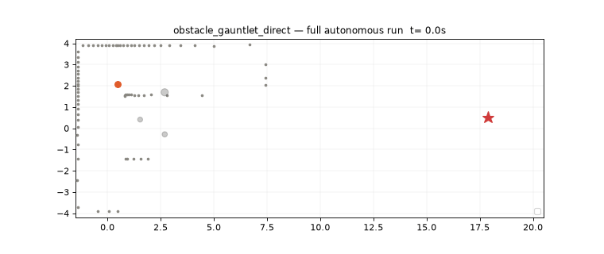

# Limo Drive

An autonomous driving software stack for the **AgileX Limo Pro** robot, written in **Rust** — built **without ROS**, on a lightweight middleware of **ZeroMQ + Protobuf**. It drives a real robot (NVIDIA Jetson Orin Nano) and a family of Gazebo simulation worlds, from an obstacle gauntlet to a generated city where it navigates sidewalks — or drives the roads like a car — among reactive pedestrians and traffic.



*Obstacle gauntlet at 2+ m/s. Also see the [city sidewalk patrol video](docs/media/city_sidewalk_patrol.mp4): sidewalk-confined driving, zebra crossings, yielding pedestrians.*

## Architecture

Three independent processes connected only by ZMQ pub/sub channels with Protobuf messages — each independently restartable, watchdog-protected, and testable:

```
┌─────────────────────┐   CH1: WorldState    ┌──────────────────┐   CH2: ControlCmd   ┌─────────────────┐
│  SENSING/PERCEPTION │ ───────(10 Hz)─────> │     PLANNING     │ ──────(10 Hz)─────> │     CONTROL     │
│  camera·lidar·IMU   │                      │  behavior + A*   │                     │  tracking + E-stop│
│  detection·SLAM·EKF │ <────────────────────│  DWA/MPC + arb.  │<── CH3: VehicleState│  chassis serial │
└─────────────────────┘      (20 Hz)         └──────────────────┘        (20 Hz)      └─────────────────┘
                        ◄════════ CH0: Heartbeat bus (all processes, 10 Hz) ════════►
```

Planning highlights: a **node-link roadmap** layer routes over standing course knowledge (Dijkstra over travel time, temporary link-blocking on live obstructions); **Hybrid A\*** with Ackermann motion primitives executes short legs inside a corridor around the route; a **tracking MPC / pure-pursuit / DWA** hierarchy executes at 10 Hz with shape-aware obstacles, braking-aware feasibility, and measured actuation-delay compensation; a safety envelope clamps everything. Fault tolerance is layered: software E-stop, command timeout, chassis firmware timeout, hardware button.

## Repository layout

| Path | Contents |
|---|---|
| `proto/` | Protobuf message contracts (the only inter-process interface) |
| `crates/` | Shared Rust crates: transport (ZMQ), HAL, proto bindings, scenario manager |
| `sensperc/` | Process 1 — sensing & perception (drivers, detection, SLAM, EKF fusion) |
| `planning/` | Process 2 — behavior, roadmap routing, Hybrid A*, DWA/MPC, arbitration |
| `control/` | Process 3 — trajectory tracking, kinematics, watchdog, chassis serial |
| `simulation/` | Gazebo worlds, world generator, gz↔ZMQ bridge, reactive-actor controllers |
| `tools/` | Launcher, visualizers, flight recorder/replay, video renderer |
| `config/` | YAML runtime configuration, roadmaps, scenarios |
| `tests/` | Unit / integration / simulation tests |

## Quick start (simulation)

Prerequisites: Rust toolchain, Python 3, [Gazebo Harmonic](https://gazebosim.org) (`brew install gz-harmonic` on macOS), `pip install pyzmq protobuf`.

```bash
make proto && cargo build --release
```

**Obstacle gauntlet** (single-goal roadmap traversal):

```bash
WORLD=$PWD/simulation/worlds/obstacle_gauntlet.sdf \
./simulation/run_gazebo_full.sh config/scenarios/obstacle_gauntlet_direct.yaml
```

**City — sidewalk robot**: the robot patrols sidewalk rings and crosses on zebra crosswalks among reactive pedestrians (they yield) and car-sized traffic:

```bash
python3 simulation/gen_city_world.py            # regenerate world artifacts (seeded)
LIMO_ROADMAP_FILE=config/maps/city_blocks_roadmap.yaml \
LIMO_CORRIDOR_HALF_WIDTH=0.65 \
WORLD=$PWD/simulation/worlds/city_blocks.sdf \
./simulation/run_gazebo_full.sh config/scenarios/city_patrol.yaml
```

**City — road driving** ("GTA mode"): the same stack drives the road network like a car — directed right-hand lanes, left turns at intersections, pedestrians crossing its road:

```bash
python3 simulation/gen_city_world.py --mode road
LIMO_ROADMAP_FILE=config/maps/city_roads_roadmap.yaml \
LIMO_CORRIDOR_HALF_WIDTH=0.55 \
WORLD=$PWD/simulation/worlds/city_roads.sdf \
./simulation/run_gazebo_full.sh config/scenarios/city_roads_drive.yaml
```

The launch script starts Gazebo (server + GUI), the gz↔ZMQ bridge, the three stack processes, the reactive-pedestrian controller, and an **accident monitor** that logs every collision to `accidents.log` with a classified cause (robot drove into party / party ran into stopped robot / side swipe). On macOS, gz-transport needs `export GZ_IP=127.0.0.1`.

Useful tools:

```bash
.venv/bin/python tools/visualizer/live_view.py --full          # live bird's-eye view
.venv/bin/python tools/visualizer/replay_view.py record --out run.limorec   # flight recorder
.venv/bin/python tools/visualizer/replay_view.py play run.limorec --full    # scrubbing replay
.venv/bin/python tools/visualizer/render_city_video.py run.limorec out.mp4  # shareable MP4
```

## Tests

```bash
cargo test            # full workspace (unit + ZMQ integration)
cargo test -p limo-planning   # planning suite (230+ tests)
```

CI runs build + test, clippy, and rustfmt on every PR.

## Hardware target

- AgileX Limo Pro (Ackermann/differential), NVIDIA Jetson Orin Nano 8 GB
- RGB camera, 2D LiDAR, IMU, wheel encoders — Ubuntu 22.04 + JetPack 6.x
